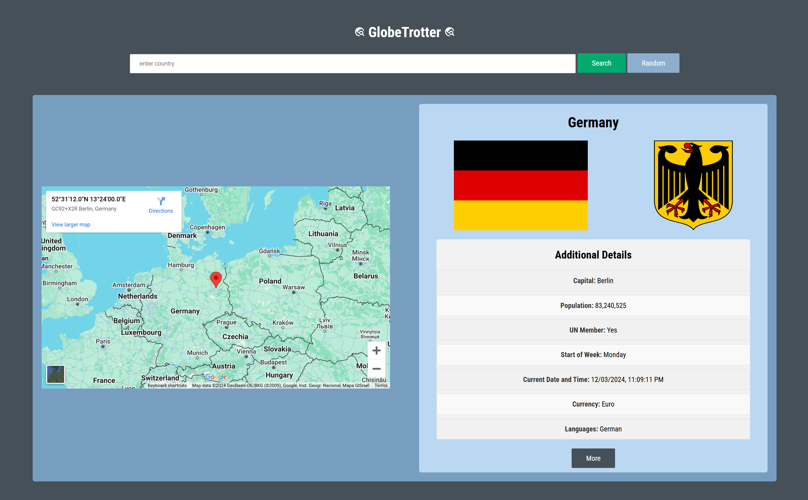
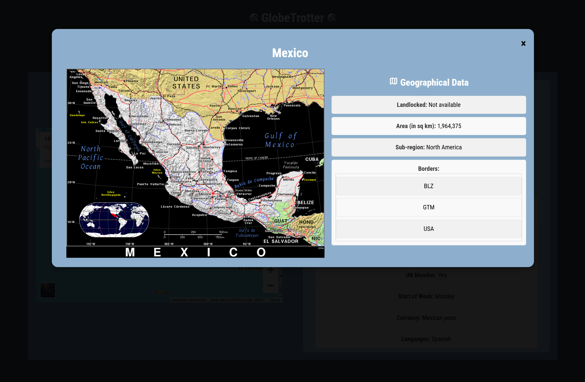

# GlobeTrotter

This project is a dynamic web application that fetches and displays detailed information about countries, including their capital, population, languages, currencies, and more. Allowing for travelers,students, or the curious to obtain general information about different countries, allowing them to make informed travel/educational decisions.The app uses data from the [REST Countries API](https://restcountries.com/) and provides an interactive user experience.

---

## Features

- Fetch and display country details such as:
  - **Capital**
  - **Population**
  - **Languages**
  - **Currencies**
  - **Borders**
  - **Start of the Week**
  - **Timezones** (with real-time clock display)
- Handles missing or unavailable data gracefully.
- Supports multiple countries and dynamically generates information.
- Provides user-friendly and interactive visualizations of country data.

---
## Wireframe

View the wireframe at [globetrotter wireframe](https://www.figma.com/design/ctBX8VmOk6WGdBMwUaR7BB/Untitled?node-id=0-1&t=knxOIEsx8ixWg2P5-1)

## Demo 

View GlobeTrotter [in action](https://www.youtube.com/watch?v=oKITJXcUM7A&ab_channel=Brooklyn) 

---

## Technologies Used

- **HTML**: Structure of the web app.
- **CSS**: Styling and layout.
- **JavaScript**: Logic, API calls, and dynamic DOM manipulation.
- **REST Countries API**: Source of country data.

---
